# 🎬 IMDB Sentiment Analysis


A Natural Language Processing (NLP) project to classify IMDB movie reviews as **positive** or **negative** using machine learning, and extract actionable business insights from text.

---

## 📌 Project Overview

| Detail | Info |
|--------|------|
| Dataset | [IMDB Movie Reviews — Hugging Face](https://huggingface.co/datasets/imdb) |
| Train Rows | 25,000 |
| Test Rows | 25,000 |
| Columns Used | `review_text`, `sentiment` |
| Target Variable | `sentiment` (positive / negative) |
| Class Balance | ✅ Perfectly balanced — 50% / 50% |

---

## 🗂️ Project Structure

```
imdb-sentiment-analysis/
│
├── IMDB Sentiment Analysis.ipynb   # Main notebook
├── images/                         # Saved visualization outputs
│   ├── sentiment_distribution.png
│   ├── review_length_distribution.png
│   ├── word_count_by_sentiment.png
│   ├── top20_words_raw.png
│   ├── top20_words_clean.png
│   ├── top10_bigrams.png
│   ├── confusion_matrix.png
│   ├── roc_curve.png
│   ├── precision_recall_curve.png
│   ├── wordcloud_positive.png
│   ├── wordcloud_negative.png
│   └── top_keywords.png
└── README.md
```

---

## 🔄 Workflow

1. **Data Loading** – Load via `load_dataset("imdb")` from Hugging Face
2. **Data Understanding** – Shape, class balance, review length distribution
3. **Data Cleaning** – Remove duplicates, nulls, encode labels
4. **EDA** – Visualize distributions, word frequencies, bigrams
5. **Text Preprocessing** – Lowercase, remove URLs/symbols, stopword removal, stemming
6. **Feature Engineering** – TF-IDF with unigrams + bigrams
7. **Model Training** – Logistic Regression & Naive Bayes with auto-selection
8. **Model Evaluation** – Accuracy, F1, ROC-AUC, Precision-Recall Curve
9. **Business Insights** – WordCloud, top keywords per sentiment class
10. **Conclusion** – Findings & recommendations

---

## 📊 Exploratory Data Analysis

### Sentiment Distribution
> Dataset is **perfectly balanced** — 12,500 negative and 12,500 positive reviews.  
> No class imbalance handling required.

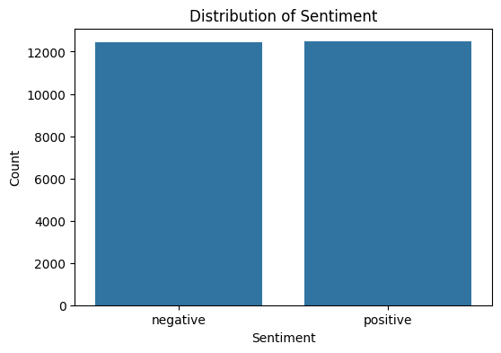

---

### Review Length Distribution
> Both sentiment classes have near-identical length distributions, skewed right with most reviews under 2,000 characters.  
> Review length alone is **not a reliable predictor** of sentiment.

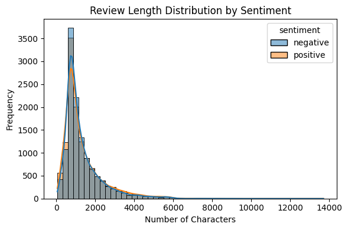

---

### Word Count by Sentiment
> Median word count is similar for both classes (~200 words).  
> Outliers exist in both classes with reviews exceeding 1,000–2,500 words.

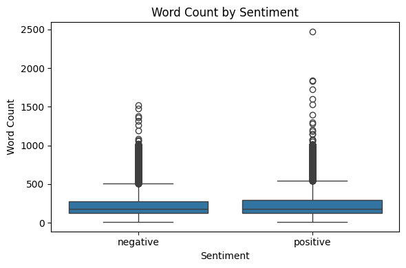

---

### Top 20 Most Common Words (Raw Reviews)
> Dominated by stopwords (`the`, `a`, `and`) and HTML artifact `/>` and `<br>`.  
> Confirms the need for HTML tag removal and stopword filtering in preprocessing.

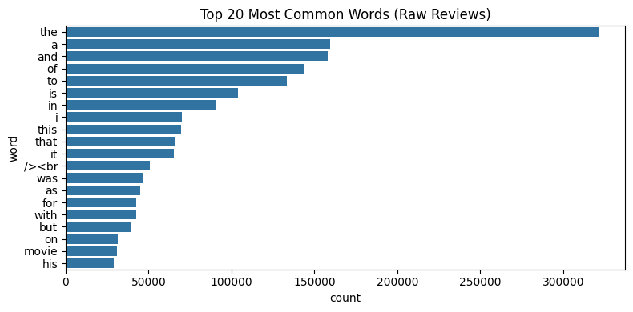

---

### Top 20 Most Common Words (Cleaned Reviews)
> After cleaning, meaningful movie-related terms emerge: `movi`, `film`, `one`, `like`, `charact`, `stori`.  
> Note: `br` still appears as rank 1 — stemmed residue from `<br>` HTML tags.  
> ⚠️ Recommendation: add explicit HTML tag removal (`re.sub(r'<.*?>', '', text)`) in `clean_text()`.

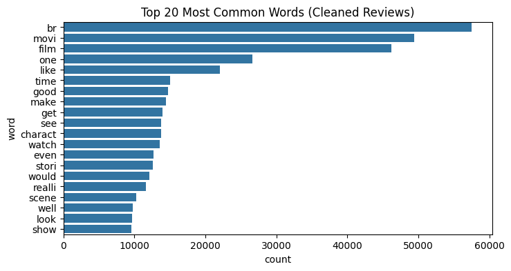

---

### Top 10 Bigrams (Cleaned Reviews)
> `br br` dominates due to HTML artifacts. Meaningful bigrams include `watch movi`, `ever seen`, `special effect`, `dont know`, and `even though`.

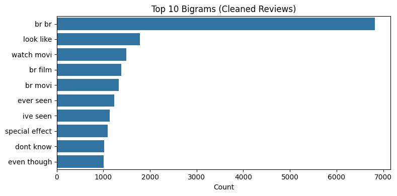

---

## 🧪 Models & Results

| Model | CV AUC | Test Accuracy | F1 (Negative) | F1 (Positive) | Weighted F1 |
|-------|--------|---------------|---------------|---------------|-------------|
| **Logistic Regression** | **0.9484** | **0.87** | **0.87** | **0.88** | **0.87** |
| Naive Bayes | 0.9287 | — | — | — | — |

> ✅ **Logistic Regression** was automatically selected as the best model based on CV AUC.  
> It outperforms Naive Bayes by **+0.0197 AUC** and delivers well-balanced precision/recall across both classes.

### Detailed Classification Report (Logistic Regression)

| Class | Precision | Recall | F1-Score | Support |
|-------|-----------|--------|----------|---------|
| Negative (0) | 0.89 | 0.85 | 0.87 | 2,486 |
| Positive (1) | 0.86 | 0.89 | 0.88 | 2,495 |
| **Accuracy** | | | **0.87** | **4,981** |
| Macro Avg | 0.87 | 0.87 | 0.87 | 4,981 |
| Weighted Avg | 0.87 | 0.87 | 0.87 | 4,981 |

---

## 🔍 Confusion Matrix

> Out of 4,981 test samples:
> - **True Negative (TN):** 2,122 — correctly identified as negative
> - **False Positive (FP):** 364 — predicted positive but actually negative
> - **False Negative (FN):** 267 — missed actual positives ⚠️
> - **True Positive (TP):** 2,228 — correctly identified as positive

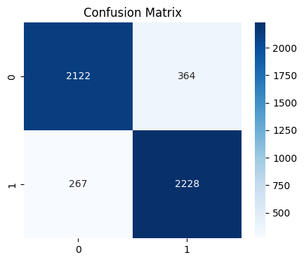

---

## 📈 ROC Curve

> AUC = **0.95** — excellent discriminative ability between positive and negative reviews.  
> The curve rises steeply near the origin, indicating strong performance even at very low false positive rates.

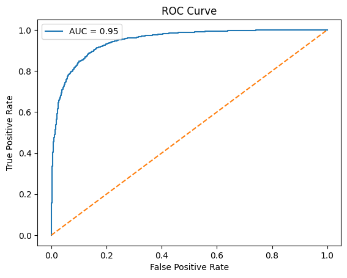

---

## 📉 Precision-Recall Curve

> High precision maintained across the full recall range, staying above **0.93** until recall approaches 1.0.  
> This indicates the model is highly reliable when predicting positive sentiment.

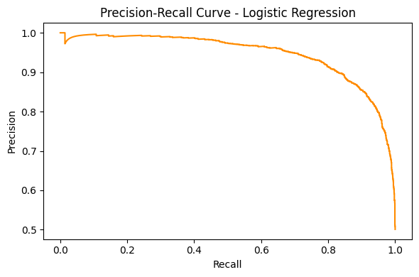

---

## ☁️ WordCloud by Sentiment

### Positive Reviews
> Dominant themes: `movi`, `film`, `love`, `great`, `stori`, `charact`, `show`, `time`, `realli`.

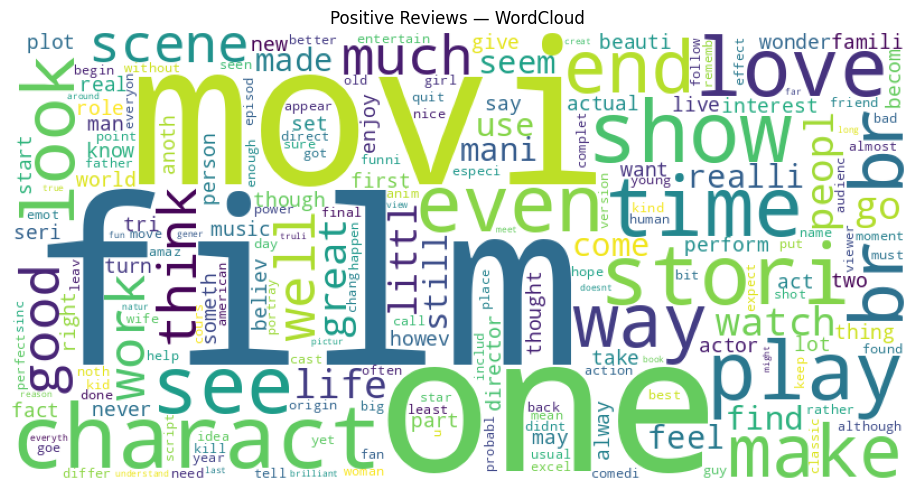

### Negative Reviews
> Dominant themes: `movi`, `film`, `show`, `bad`, `scene`, `even`, `one`, `stori`, `look`.  
> Notably shares many neutral terms with positive reviews — the model relies on context and weighting, not just word presence.

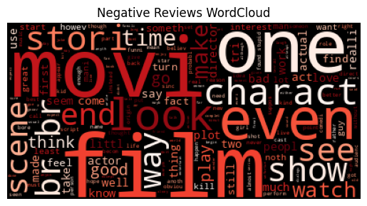

---

## 🏆 Top 10 Most Influential Keywords

> Keywords extracted from Logistic Regression coefficients — higher absolute value = stronger signal.

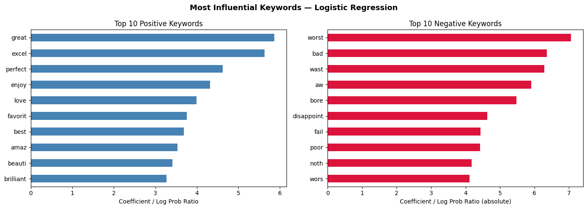

| Rank | Positive Keywords | Score | Negative Keywords | Score (abs) |
|------|-------------------|-------|-------------------|-------------|
| 1 | `great` | 5.86 | `worst` | 7.06 |
| 2 | `excel` | 5.63 | `bad` | 6.36 |
| 3 | `perfect` | 4.62 | `wast` | 6.29 |
| 4 | `enjoy` | 4.32 | `aw` | 5.91 |
| 5 | `love` | 3.99 | `bore` | 5.47 |
| 6 | `favorit` | 3.76 | `disappoint` | 4.63 |
| 7 | `best` | 3.69 | `fail` | 4.44 |
| 8 | `amaz` | 3.54 | `poor` | 4.42 |
| 9 | `beauti` | 3.41 | `noth` | 4.18 |
| 10 | `brilliant` | 3.27 | `wors` | 4.12 |

> 💡 Negative keywords tend to have **higher absolute coefficients** than positive ones, suggesting negative sentiment is expressed more strongly/explicitly in language.

---

## 💡 Business Insights & Recommendations

| Finding | Recommendation |
|---------|---------------|
| `great`, `perfect`, `excel` are top positive signals | 🎯 Use these in marketing copy and promotional materials |
| `worst`, `bore`, `disappoint` are top negative signals | 🚨 Flag reviews containing these for priority customer response |
| `<br>` HTML artifacts pollute cleaned text | 🛠️ Add explicit HTML stripping to `clean_text()` |
| Model achieves 0.87 accuracy on balanced data | 🤖 Deploy as real-time review screening tool |
| Negative keywords have higher absolute weights | 📊 Negative feedback is linguistically stronger — prioritize resolution |

---

## 🛠️ Tech Stack

| Library | Purpose |
|---------|---------|
| `pandas`, `numpy` | Data manipulation |
| `matplotlib`, `seaborn` | Visualization |
| `nltk` | Stopwords, stemming, n-grams |
| `scikit-learn` | TF-IDF, modeling, evaluation |
| `wordcloud` | Sentiment word visualization |
| `datasets` (HuggingFace) | Dataset loading |

---

## 🚀 How to Run

1. **Clone the repository**
   ```bash
   git clone https://github.com/your-username/imdb-sentiment-analysis.git
   cd imdb-sentiment-analysis
   ```

2. **Install dependencies**
   ```bash
   pip install pandas numpy matplotlib seaborn nltk scikit-learn wordcloud datasets
   ```

3. **Open the notebook**
   ```bash
   jupyter notebook "IMDB_Sentiment_Analysis.ipynb"
   ```

   Or open directly on [](https://colab.research.google.com/drive/1-ySrGApoOKg8LGaZnb8lRGhdLQGDQ_2u)

---

## 📄 License

This project is open-source and available under the [MIT License](LICENSE).

---

## 🙋 Author

Made by [adin-alxndr](https://github.com/adin-alxndr/)
